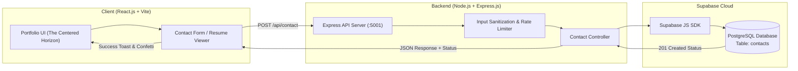

# 🌟 Prarthana Reddy — Full-Stack Portfolio

A modern, high-performance, and responsive personal portfolio website built with **React.js**, **Node.js/Express.js**, and **Supabase (PostgreSQL)**.

Designed following **"The Centered Horizon"** aesthetic—featuring a perfectly symmetrical center-aligned header transitioning into clean, structured left-aligned sections with geometric diamond bullet points (`◆`).

---

## 📑 Table of Contents
- [Project Overview](#-project-overview)
- [Design Philosophy: The Centered Horizon](#-design-philosophy-the-centered-horizon)
- [Tech Stack](#-tech-stack)
- [Architecture & Workflow](#-architecture--workflow)
- [Supabase Database Setup (SQL)](#-supabase-database-setup-sql)
- [Environment Variables](#-environment-variables)
- [Local Installation & Setup](#-local-installation--setup)
- [API Endpoints](#-api-endpoints)
- [Project Structure](#-project-structure)

---

## 🎯 Project Overview

This portfolio showcases the technical skills, machine learning projects, and academic background of **Prarthana Reddy** (Bachelor of Computer Applications, 2026 Graduate specializing in AI/ML & Full-Stack Web Development).

### Key Features:
- **The Centered Horizon Header**: Center-aligned Name, Title, Contact links, Avatar, and Summary.
- **Geometric Diamond Bullets (`◆`)**: Custom diamond markers and divider clusters replacing conventional bullet points.
- **Categorized Skills Arsenal**: Visual grid of Programming Languages, AI/ML, Web Development, and Tools with proficiency tags.
- **Interactive Project Showcase**: Deep dives into custom NLP models (10k+ data points, +28% accuracy boost), ML predictive pipelines (92% accuracy, -35% ETL overhead), and high-speed web systems (< 1.2s load, 98/100 Lighthouse).
- **Full-Stack Contact Form**: Secure message submission connecting React to Express and persistent Supabase PostgreSQL storage with instant toast alerts and celebration animations.
- **Resume Viewer & PDF Export**: In-browser printable resume paper viewer with one-click PDF downloading.

---

## 🎨 Design Philosophy: The Centered Horizon

- **Symmetrical Introduction**: The top hero introduces the candidate formally with centered alignment, luminous obsidian gradients, and social links.
- **Left-Aligned Content Horizon**: Below the horizon divider, content seamlessly transitions to left-aligned bulleted timelines for optimal readability.
- **Subtle Luxury & Geometric Accents**: Cyan (`#38bdf8`), Emerald (`#10b981`), and Indigo accents on deep obsidian glass surfaces.

---

## 💻 Tech Stack

| Layer | Technologies |
|---|---|
| **Frontend** | React 18 (Functional Components, Hooks, React Router 6), Vanilla CSS (Custom Design System), Lucide Icons, Canvas Confetti, Vite |
| **Backend** | Node.js, Express.js (ES Modules), CORS, Helmet, Express-Rate-Limit, Dotenv |
| **Database** | Supabase (Managed PostgreSQL) with `@supabase/supabase-js` |
| **Hosting & Infra**| 100% Free-Tier Compatible (Vercel/Netlify for Frontend, Render/Railway for Backend, Supabase Free Tier) |

---

## 🏗️ Architecture & Workflow



### Data Flow:
1. User completes the contact form on the React UI.
2. The frontend validates fields and sends a `POST` JSON request to Express at `/api/contact`.
3. Express validates inputs, applies IP-based rate limiting, and sanitizes fields.
4. Express queries Supabase using `@supabase/supabase-js` to insert the row into the `contacts` table in PostgreSQL.
5. Supabase confirms the insert, and Express returns `HTTP 201 Created` with a JSON confirmation.
6. The frontend displays an animated success toast and celebratory confetti.

---

## 🗄️ Supabase Database Setup (SQL)

Log in to your [Supabase Dashboard](https://supabase.com/dashboard), open the **SQL Editor**, and run the following SQL script to create the `contacts` table and enable secure Row Level Security (RLS) policies:

```sql
-- 1. Create the contacts table
CREATE TABLE IF NOT EXISTS public.contacts (
    id UUID DEFAULT gen_random_uuid() PRIMARY KEY,
    name VARCHAR(255) NOT NULL,
    email VARCHAR(255) NOT NULL,
    subject VARCHAR(255) DEFAULT 'General Portfolio Inquiry',
    message TEXT NOT NULL,
    created_at TIMESTAMPTZ DEFAULT TIMEZONE('utc'::text, NOW()) NOT NULL
);

-- 2. Create index on email and created_at for fast querying
CREATE INDEX IF NOT EXISTS idx_contacts_email ON public.contacts(email);
CREATE INDEX IF NOT EXISTS idx_contacts_created_at ON public.contacts(created_at DESC);

-- 3. Enable Row Level Security (RLS)
ALTER TABLE public.contacts ENABLE ROW LEVEL SECURITY;

-- 4. Allow insert policy for anon / public role (portfolio submissions)
CREATE POLICY "Allow public anon inserts to contacts table"
ON public.contacts
FOR INSERT
TO anon, authenticated
WITH CHECK (true);

-- 5. Restrict viewing / select queries to authenticated service role only
CREATE POLICY "Allow service role read access"
ON public.contacts
FOR SELECT
TO service_role
USING (true);
```

---

## 🔐 Environment Variables

### Backend (`backend/.env`)
Copy `backend/.env.example` to `backend/.env`:

```env
# Server Port
PORT=5001
NODE_ENV=development

# Supabase PostgreSQL Configuration
# Found under Supabase Dashboard -> Project Settings -> API
SUPABASE_URL=https://your-project-ref.supabase.co
SUPABASE_ANON_KEY=your-supabase-anon-public-key-here

# Client Origin for CORS
CORS_ORIGIN=http://localhost:5173
```

> **Note**: If `SUPABASE_URL` and `SUPABASE_ANON_KEY` are not configured yet, the backend automatically operates in **Local Demo Mode**, gracefully logging contact inquiries in the console without failing.

---

## 🚀 Local Installation & Setup

### Prerequisites
- **Node.js**: v18.0.0 or higher
- **npm**: v9.0.0 or higher

---

### Step 1: Clone or Navigate to the Project
```bash
cd c:\Users\LENOVO\Desktop\wedsite
```

---

### Step 2: Set up and Run the Backend Server

```bash
# Navigate to backend directory
cd backend

# Install dependencies
npm install

# Start Express development server
npm run dev
# (or 'npm start' to run with Node)
```
The server will start listening at **`http://localhost:5001`**.

Verify backend health:
```bash
curl http://localhost:5001/api/health
```

---

### Step 3: Set up and Run the Frontend Client

Open a **new terminal window** and run:

```bash
# Navigate to frontend directory
cd frontend

# Install dependencies
npm install

# Launch Vite development server
npm run dev
```

Open your browser and navigate to **`http://localhost:5173`**.

---

## 📡 API Endpoints

### 1. `GET /api/health`
Checks server status and database connectivity.
- **Response `200 OK`**:
```json
{
  "status": "online",
  "timestamp": "2026-08-22T10:45:00.000Z",
  "database": {
    "provider": "Supabase PostgreSQL",
    "configured": true,
    "mode": "Live"
  },
  "version": "1.0.0",
  "owner": "Prarthana Reddy"
}
```

### 2. `POST /api/contact`
Submits a message from the contact form.
- **Request Body**:
```json
{
  "name": "Alex Johnson",
  "email": "alex@company.com",
  "subject": "AI/ML Developer Role",
  "message": "Hi Prarthana, we loved your Grok NLP model and would like to interview you."
}
```
- **Success Response `201 Created`**:
```json
{
  "success": true,
  "message": "Thank you! Your message has been sent and stored successfully.",
  "data": {
    "name": "Alex Johnson",
    "email": "alex@company.com",
    "subject": "AI/ML Developer Role",
    "message": "Hi Prarthana, we loved your Grok NLP model and would like to interview you.",
    "created_at": "2026-08-22T10:45:00.000Z"
  }
}
```
- **Error Response `400 Bad Request`**:
```json
{
  "success": false,
  "error": "Please provide a valid email address."
}
```

---

## 📂 Project Structure

```
wedsite/
├── README.md                      # Comprehensive project guide & SQL scripts
├── backend/
│   ├── .env                       # Local environment variables
│   ├── .env.example               # Environment variables template
│   ├── package.json               # Backend dependencies & scripts
│   ├── generate-pdf.js            # PDF generator utility
│   └── src/
│       ├── server.js              # Express app setup, CORS, Helmet, Rate Limiter
│       ├── config/
│       │   └── supabase.js        # Supabase client initialization & validation
│       ├── controllers/
│       │   └── contactController.js # Contact submission & health controllers
│       └── routes/
│           └── contactRoutes.js   # Route definitions for /api/contact & /api/health
└── frontend/
    ├── index.html                 # HTML shell with Google Fonts & SEO metadata
    ├── package.json               # Frontend dependencies & Vite scripts
    ├── vite.config.js             # Vite config with backend proxy on /api
    ├── public/
    │   ├── profile.jpg            # Candidate portrait
    │   └── resume.pdf             # Downloadable resume document
    └── src/
        ├── main.jsx               # React entry point with BrowserRouter
        ├── App.jsx                # Layout, route configurations, global Toast
        ├── assets/
        │   └── profile.jpg        # Profile portrait asset
        ├── components/
        │   ├── Navbar.jsx         # Sticky header with active links & mobile menu
        │   ├── CenteredHeader.jsx # "The Centered Horizon" symmetrical header
        │   ├── DiamondBullet.jsx  # Geometric diamond list marker and horizon divider
        │   ├── Icons.jsx          # Custom SVG vectors for GitHub, LinkedIn
        │   ├── Toast.jsx          # Animated notification alert
        │   └── Footer.jsx         # Symmetrical footer with social channels
        ├── data/
        │   └── resumeData.js      # Structured resume dataset for Prarthana Reddy
        ├── pages/
        │   ├── Home.jsx           # Centered Horizon hero, metrics, featured projects
        │   ├── About.jsx          # Extended bio, philosophies, education, certifications
        │   ├── Skills.jsx         # Categorized skills grid with level filters
        │   ├── Projects.jsx       # Card-based project catalog with metrics & links
        │   ├── Contact.jsx        # Contact form connected to Express API
        │   └── ResumeView.jsx     # Printable resume paper view with direct PDF export
        └── styles/
            └── index.css          # The Centered Horizon design system stylesheet
```

---

## 🛡️ License
MIT License. Created for **Prarthana Reddy**'s Professional Portfolio.
